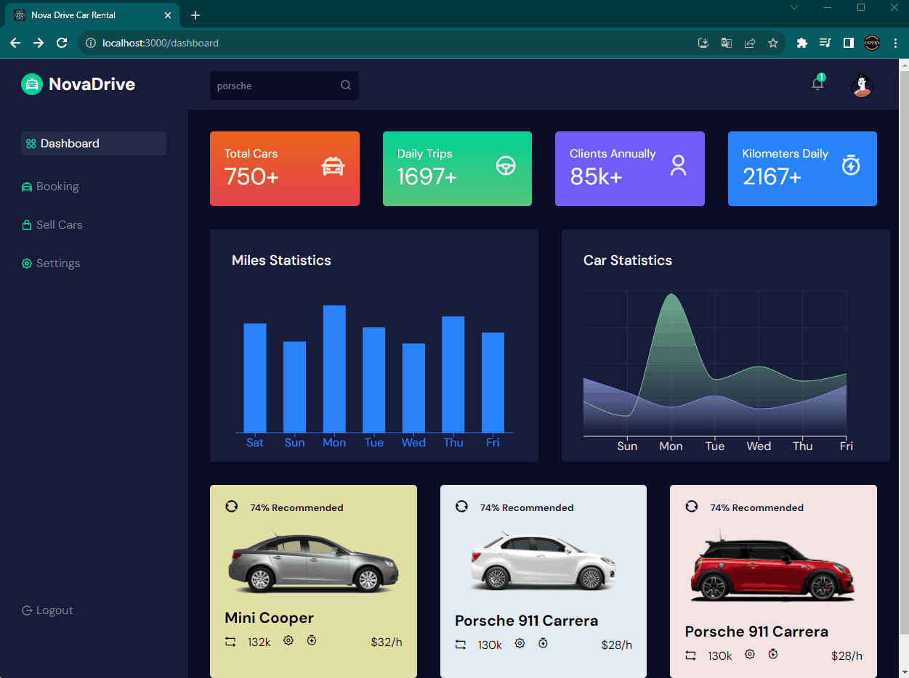

<h1>
 Car Rental Dashboard with ReactJS 
</h1>

"Experience the epitome of modern web development with Car Rental Company Dashboard built from the ground up using React JS. Navigate seamlessly through our user-friendly interface powered by react-router-dom, and enhance your designs with captivating remix icons. Harness the power of React's useState and useEffect hooks to effortlessly manage data and optimize user interactions. Immerse yourself in sleek CSS3 designs, showcasing a stunning array of car offers and providing admins with intuitive control over their profiles, weekly mileage averages, and comprehensive car statistics. With dynamic React charts and captivating circular progress bars,dashboard empowers administrators to make informed decisions, setting new standards for the future of car rental management."

<h1>Used Technologies </h1>
<ul>

<h1>
 Preview 🎥
</h1>

"# admindashboard" 
